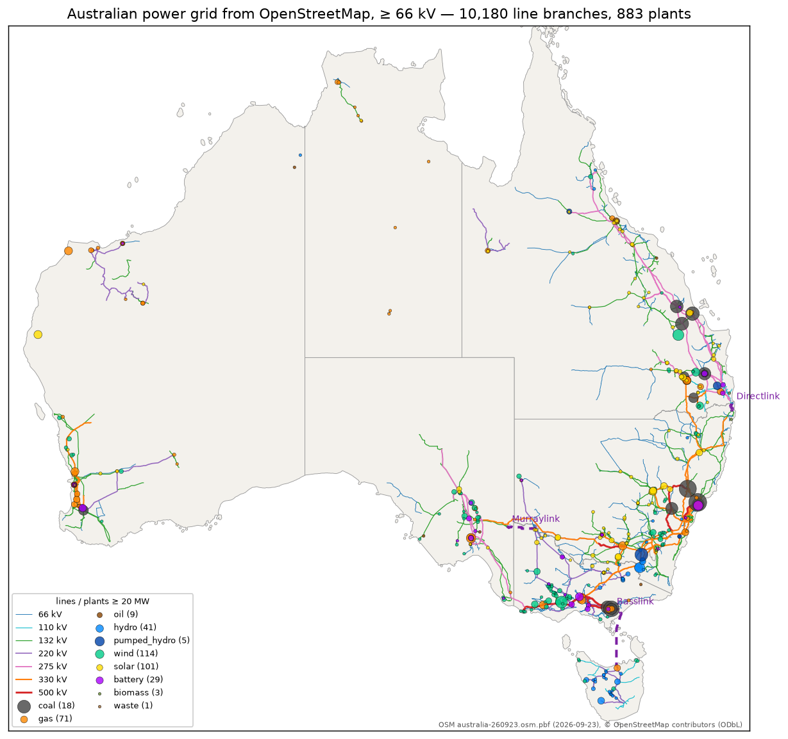

# All-AU-Grid map

Interactive map of the Australian power grid built automatically from OpenStreetMap
(the Australian counterpart of [All-Japan-Grid](https://lutelute.github.io/All-Japan-Grid/) and
[all-US-Grid](https://lutelute.github.io/all-US-Grid-map/)). OSM snapshot: `australia-260923.osm.pbf 2026-09-23`, lines ≥ 66 kV.

- **Map / 地図:** https://lutelute.github.io/all-AU-Grid-map/ — lines coloured by synchronous system
  (NEM mainland, Tasmania, SWIS, NWIS, Darwin–Katherine, Alice Springs, Mount Isa) or voltage;
  substations, plants (fuel, MW), converter stations, compensators, HVDC links (Basslink,
  Murraylink, Directlink), interstate interconnectors, state outlines; line colour
  "潮流（負荷率）" shows an estimated AC power-flow snapshot (NEM 2026-01-07 17:55 AEST,
  SWIS 2026-02-02 18:30 AWST).

Basemaps load live: Sentinel-2 cloudless 2016 (EOX, CC BY 4.0) nationally, NSW Spatial Services
(CC BY 3.0 AU) and Queensland (CC BY 4.0) aerial imagery from zoom 10, DEA GeoMAD Landsat
(Geoscience Australia, CC BY 4.0), OpenStreetMap.

## Disclaimer / 免責事項

> This data is generated **automatically by machine processing** of OpenStreetMap. It does
> **not** reflect official information from any network operator, AEMO or government agency,
> and may contain errors and omissions. Synchronous systems are connected components named by
> anchor cities; plant capacities are OSM tag values; plant-to-bus links are partly
> nearest-bus estimates. Power-flow values use default line parameters, population-based
> demand and pro-rata dispatch: **they are model estimates, not measured flows. Use at your own risk.**
>
> 本データは OpenStreetMap を **機械的に自動処理** して生成したものです。送電事業者・AEMO・政府機関の
> 公式情報では **ありません**。誤り・欠落を含む可能性があります。同期系統は目印の都市で名付けた連結成分、
> 発電所の出力は OSM のタグ値、発電所の接続先は一部が最寄り母線による推定です。潮流の値は既定の線路定数・
> 人口比例の需要・容量比の給電による **推定値で、実測ではありません**。**利用は自己責任** でお願いします。

## Data & license

Contains information from OpenStreetMap, which is made available here under the
[Open Database License (ODbL)](https://opendatacommons.org/licenses/odbl/). The data inlined in
the page (JSON inside the HTML) is a derivative database and is ODbL as well.

- Transmission lines, substations, plants, converters, compensators, state boundaries:
  © [OpenStreetMap contributors](https://www.openstreetmap.org/copyright).
- Power-flow snapshot inputs: regional demand © AEMO (Aggregated Price and Demand; WEM Operational
  Demand; used under AEMO's general copyright permission with attribution); population
  © Commonwealth of Australia (ABS Population Grid 2025, CC BY 4.0).
- Basemap imagery: © EOX IT Services GmbH (contains modified Copernicus Sentinel data 2016);
  © Spatial Services, Department of Customer Service NSW; © State of Queensland (partly © Planet Labs);
  © Commonwealth of Australia (Geoscience Australia).
